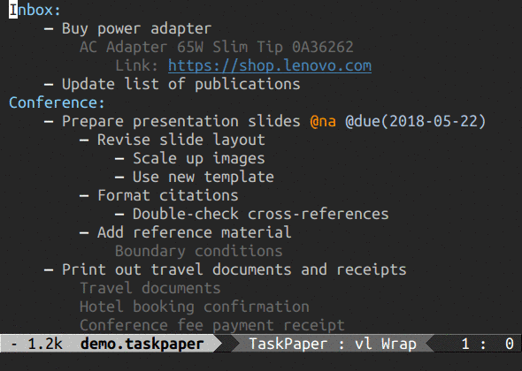
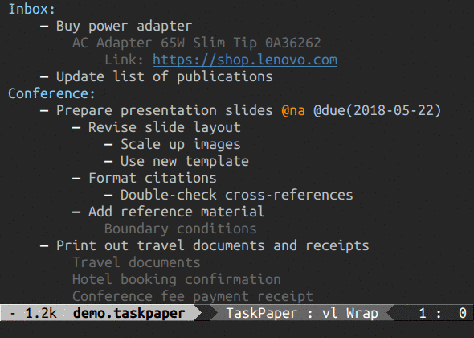

# Emacs TaskPaper Mode [![MELPA][melpa-badge]][melpa-link]

TaskPaper mode is an Emacs major mode for working with files in TaskPaper format. The format was invented by Jesse Grosjean and named after his [TaskPaper][taskpaper] macOS app, which is a system for organizing your outlines and tasks in a text file. The format itself is exceptionally readable and supports different item types, outline hierarchy, and tagging.

TaskPaper format knows about four things: _projects_, _tasks_, _notes_, and _tags_. Items can be indented (using literal tabs) under other items to create outline structure, which defines parent-child hierarchical relationship:

```text
Project meeting: @sintef
    - Select and invite participants @next
    - Prepare and distribute meeting agenda
    - Book conference room @due(2018-06-20)
        Room M-2612
    - Print handouts @due(2018-05-12) @done(2018-05-11)
    - Review meeting notes @waiting
```

The file format is fairly simple:

- Files are expected to use the UTF-8 encoding and use a newline (`\n`) to separate lines.

- Each line makes a new item: project, task, or note.

- A task is a line that begins with a hyphen (`-`) followed by a space, which can optionally be prefixed (i.e., indented) with tabs. A task can have zero or more tags anywhere on the line (not just trailing at the end).

- A project is a line that isn't a task and ends with a colon (`:`) followed by a newline. Tags can exist after the colon, but if any non-tag text is present, then it won't be recognized as a project.

- A note is any non-blank line that doesn't match the task or project rules. A note can have zero or more tags anywhere on the line.

- A tag consists of an at symbol (`@`) preceded by a space and followed by a tag name. Tags can optionally have a value in parentheses after the tag name.

Indentation level (with tabs, not spaces) defines ownership. For instance, if you indent one task under another task, then it is considered a subtask. Projects, tasks, and notes own all items that are indented underneath them. The nesting can go as deep as you need it to be. Empty lines are ignored when calculating ownership.

The system doesn't force any particular workflow on you; it provides basic outlining and list making elements for you to use as you see fit.





TaskPaper mode is implemented on top of Outline mode. Visibility cycling and structure editing help to work with the outline structure. Special commands also provided for outline-aware filtering, tags manipulation, sorting, refiling, and archiving of items. For querying a collection of TaskPaper files, TaskPaper mode also includes a powerful Agenda mode.

# Documentation

Following documentation is available:

- [TaskPaper mode manual][manual] explains installation, usage, and basic customization.
- [Scripting guide][scripting-guide] describes more advanced customization, hacking and scripting.

# Acknowledgments

Thanks to Jesse Grosjean for writing the [TaskPaper app][taskpaper] for macOS, whose functionality and sleekness I wanted to bring to Emacs. The [TaskPaper project][github-taskpaper] gave me some valuable implementation insights.

I would also thank the following people, from whose work TaskPaper mode has benefited greatly:

- Carsten Dominik, Bastien Guerry and other Org mode developers for creating and maintaining the [Org mode][emacs-orgmode] package for Emacs, from which ideas and implementation I borrowed liberally;

- Stephen Berman and Stefan Monnier for creating and maintaining the [adaptive-wrap][emacs-adaptive-wrap] package;

- Piotrek Wilczyński for developing the [TodoFlow][todoflow] Python module.

# Bugs

TaskPaper mode is developed and tested primarily for compatibility with GNU Emacs v25.1 and later. If you find any bugs in TaskPaper mode, please construct a test case or a patch and open a ticket on the [GitHub issue tracker][github-issues].

# License

This program is free software; you can redistribute it and/or modify it under the terms of the GNU General Public License as published by the Free Software Foundation; either version 3, or (at your option) any later version.

This program is distributed in the hope that it will be useful, but WITHOUT ANY WARRANTY; without even the implied warranty of MERCHANTABILITY or FITNESS FOR A PARTICULAR PURPOSE. See the GNU General Public License for more details.

You should have received a copy of the GNU General Public License along with this program. If not, see <http://www.gnu.org/licenses/>.

[melpa-badge]: https://melpa.org/packages/taskpaper-mode-badge.svg

[melpa-link]: https://melpa.org/#/taskpaper-mode

[taskpaper]: https://www.taskpaper.com/

[manual]: ./manual.md

[scripting-guide]: ./scripting.md

[github-taskpaper]: https://github.com/jessegrosjean/TaskPaper

[emacs-orgmode]: http://orgmode.org/

[emacs-adaptive-wrap]: https://elpa.gnu.org/packages/adaptive-wrap.html

[todoflow]: https://github.com/bevesce/TodoFlow

[github-issues]: https://github.com/saf-dmitry/taskpaper-mode/issues

